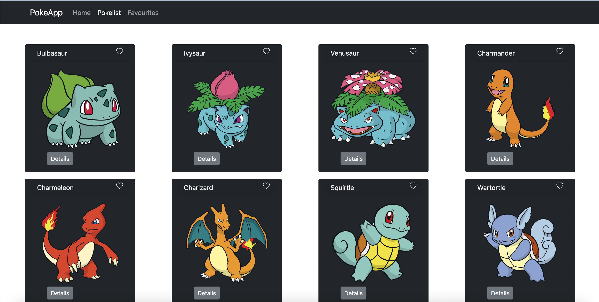

# PokeApp

- A Small project to refresh knowledge of React and introducing hooks. Utilising REST API getting data from https://pokeapi.co/

## Technologies used

Built with:

- HTML
- JS
- CSS
- Bootstrap
- Reactjs
- Component Libraries
- REST API

## Setup and usage

Live page [here](https://github.com/margittennosaar/markdown_study_materials)

## Screenshot

## Sources

https://pokeapi.co/

## Authors and acknowledgment

Martin Holland
Github: http://github.com/martin-holland
